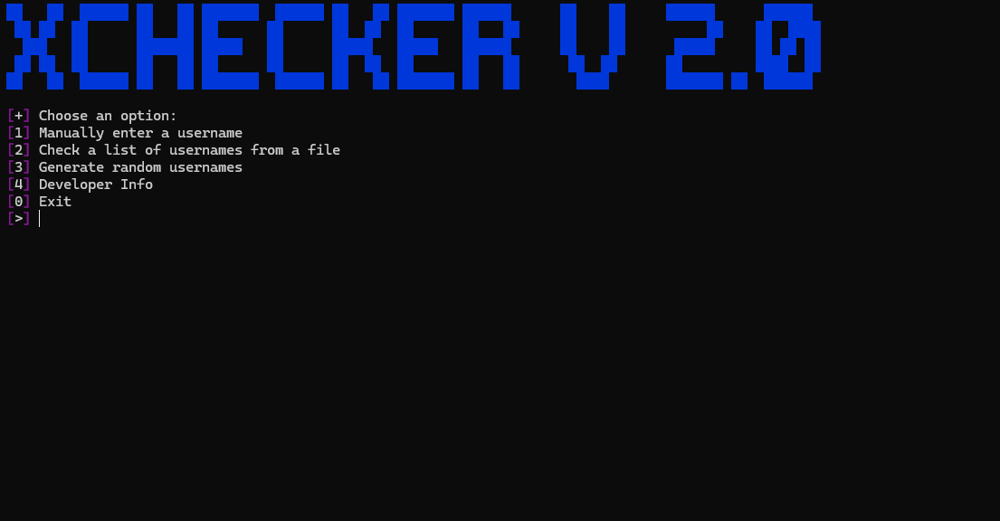

# Roblox-Username-Checker

👋 Welcome to Roblox Username Validator, a Python script that validates the availability and appropriateness of Roblox usernames.

---

## 🔍 Features:
- **Manual Checks**: Enter a single username to check its validity and availability.
- **Batch Checks**: Validate a list of usernames from a `.txt` file.
- **Random Username Generation**: Generate random usernames to check availability.
- **Duplicate Removal**: Automatically removes duplicate usernames from input files.
- **Colored Output**: Get clear results with colored messages using `colorama`.

---

## ✅ Output:
- **Valid Usernames**: Saved to `valid.txt`.
- **Invalid Usernames**: Displayed in the console with specific error reasons.

---

## 🚀 Requirements:
- Python 3.x
- Libraries: `requests`, `colorama`

---

## 🛠 Setup:
1. Clone the repository:
   ```bash
   git clone https://github.com/VVoiddd/Roblox-Username-Checker.git
   cd Roblox-Username-Checker
   ```
2. Install the required libraries:
   ```bash
   pip install -r requirements.txt
   ```
3. Run the script:
   ```bash
   python main.py
   ```

---

## 🎥 Demo:
Check out the video walkthrough below to see how to use the Roblox Username Checker in action!

[](https://youtu.be/xWfc6wkExKs)

---

## 📸 Screenshot:


---

## 🧑‍💻 Developer Credits:
- **Base idea by jprocks101**: This project was initially conceptualized by jprocks101. A big thank you for laying the groundwork!
- **Expanded by Void**: Enhancements and new features were added by Void, making it more versatile and user-friendly.

---

## 🔗 Version Info:
- **Old Version (1.0)**: [https://github.com/jprocks101/Roblox-Username-Checker](https://github.com/jprocks101/Roblox-Username-Checker)
- **New Version (2.0)**: [https://github.com/VVoiddd/Roblox-Username-Checker](https://github.com/VVoiddd/Roblox-Username-Checker)

💻 Happy Checking!
```
